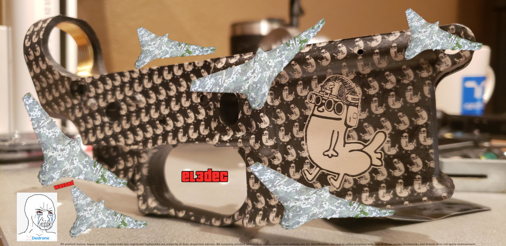

# EL3dec



## What is this?

This is a very simple library (C++) capable of decoding raw packet streams from Eleron-3 drones as
of September 2022. A prototype was in development mostly by one volunteer in the team, and actively
used since May 2022, provided free of charge and with the assistance of motivated peers in Ukraine.

Subreption provided input for including RabbitMQ functionality to assist in creating a distributed,
federated network of sensors providing real-time battlefield information, besides other ideas, as
well as reverse engineering of the firmware in Microhard modems.

Unfortunately, an internal investigation spanning three months revealed that a third-party provided
access to the prototype for commercial vendors of counter-drone systems and other business
entities, violating the altruistic principle of the collaboration. In order to maximize the
remaining usefulness of the system, the solution had to be made available en masse, instead of
benefiting a select "club" that was never entitled to exclusive access.

This version of the library is limited to telemetry (passive detection) packets.

## What do I need to use it?

The library and sample applications consume a raw payload as decoded from a Microhard 920 or LoRa-like
transmission from an Eleron 3 drone.

Therefore, a separate FSK burst detector, de-modulator, de-scrambler and simple decoder is needed to
extract the encapsulating frame. We will detail the steps and process so that any developer with
DSP and signals analysis experience can potentially write a reliable Microhard 920 frame decoder
compatible with COTS Software-Defined Radio hardware such as the HackRF, Pluto, etc.

A separate document will detail (including reduced signal samples) the building blocks needed.

### Hardware

We recommend COTS SDR receivers like the HackRF (inexpensive) with additional filtering and
pre-amplification limited to the 900-925MHz spectrum. Better options include Pluto or Ettus clones.
HackRF is noticeably "deaf" in the necessary spectrum, but it has performed perfectly fine so far
with a crude prototype for months.

Amusingly enough, much can be gleaned from FCC filings from counter-UAS vendors, such as Dedrone,
for example with the FCC ID 2AO3N-TH45P6EROZ. This information is unrestricted and publicly accessible.
Document 4446632, titled "Internal Photos RF - 160", or 4100173, "Internal Photos - RF300" contain
pictures of the internals such systems. USRP B210 or two HackRF boards are clearly visible, as well
as a presumably Linux-based SBC (likely using a standard Linux userland and kernel with GPL components).
Other vendors like Aaronia produce their own hardware but also use x86-based computing platforms.

**These systems are often sold in the range of four to five figures per unit, minimum.**

A similarly spec'd system can be built from COTS parts for under 300 USD, without being tied to
a cloud or network-based service, and having complete control of the infrastructure. Cost can be
heavily reduced by reusing parts harvested from cell base stations and decommissioned equipment.

#### On CUAS products: effectiveness and deceptive marketing

There is absolutely no reason to justify the expenditure of millions in overpriced gear, when that
will come at a cost of deprived funding for humanitarian efforts. In addition, the vast majority of
CUAS vendors are wildly ineffective or downright useless (jamming systems do not work against
drones with IMU/GPS-less navigation capabilities, for example). The actual knowledge of CUAS vendors
(or at least, those in management or finance positions with decision making power) is so out of touch
with reality, that in some cases they obviate the existence of dedicated solutions more effective
to the task (for example, home-on-jam munitions, or satellite imagery to locate jamming platforms,
versus any direction finding product), an opinion shared and known among those with far more experience
than us in that area of expertise.

A fitting analogy would be looking at most CUAS vendors as used cars salesmen posing as plumbers...
sent to do a plumbing job in a flooded, leaking toilet.

## Will publishing this source code not compromise its usefulness?

Certainly. But not any more than the absolutely irresponsible and abysmally insecure circulation
of the original prototype. Commercial CUAS vendors have ghastly security practices, their systems
most often involving yesteryear embedded Linux systems with exposed network interfaces, and their
daily operations do not involve trained computer security professionals with any semblance of real
experience or talent in protecting assets like these against "malicious actors", and that is
without considering insider threats. Their hoarding or attempts to withhold information have more to
do with financial interests than actual desire to keep capabilities intact.

They have made it resoundingly clear that they think of Ukraine and any capabilities helping either
side of the war as trade or commercial assets, and nothing else. In addition, individuals that accept
bribes for positioning commercial vendors are by definition and nature suspect and likely to endanger
such capabilities purely for personal gain.

All in all, these circumstances indicate that institutions in Ukraine and elsewhere do well by not
trusting the marketing claims of opportunistic foreign vendors, and employing all state security structures
to hunt for corrupt officials accepting bribes (assuming top officials aren't involved). This remains
a problem even in otherwise stable nations, with well known corruption cases regularly appearing in
press, affecting law enforcement organizations, with petty corruption rooted in procurement offices.

## Sample applications

Two applications are provided for testing purposes:

 - A simple decoder for a single payload, with JSON human-readable output.
 - An asynchronous WebSockets server consuming hex-encoded telemetry payloads, decoding the telemetry information and responding with a JSON structure, capable of logging all successful decodes. Originally this was written as an example for a blackbox system, disengaging the telemetry decoder to keep the capability away from prying eyes.

### el3dec_netdaemon

Usage:

```
$ ./apps/el3dec_netdaemon --help
Allowed options:

General options:
  --help                 produce a help message

Server options:
  --address arg          address (to listen for connections)
  --port arg             port

Backend options:
  --num-threads arg      the initial number of threads
```

Example (using tests fixture data):

```
$ ./apps/el3dec_netdaemon --num-threads 2 --address 0.0.0.0 --port 8081
[2022-09-13 01:53:45.896909] EL3: Listening (2 threads)
[2022-09-13 01:53:51.549738] EL3: Connection from 127.0.0.1
[2022-09-13 01:53:51.551667] EL3: UAV ID:1337 Type:1 Time:16:48:57 Lat:47.663658 Lon:36.502651 Alt:781 Speed:55.5 VideoFreq:1214 Rem:90 Camera: A:3.15 Z:-89 P:-13.3
[2022-09-13 01:53:51.552030] EL3: UAV ID:1337 Type:1 Time:16:48:57 Lat:47.663658 Lon:36.502651 Alt:781 Speed:55.5 VideoFreq:1214 Rem:90 Camera: A:3.15 Z:-89 P:-13.3
[2022-09-13 01:53:51.552310] EL3: UAV ID:1337 Type:1 Time:16:48:57 Lat:47.663658 Lon:36.502651 Alt:781 Speed:55.5 VideoFreq:1214 Rem:90 Camera: A:3.15 Z:-89 P:-13.3
[2022-09-13 01:53:51.552547] EL3: UAV ID:1337 Type:1 Time:16:48:57 Lat:47.663685 Lon:36.502583 Alt:781 Speed:55.5 VideoFreq:1214 Rem:90 Camera: A:3.35 Z:-88.8 P:-13.5
[2022-09-13 01:53:51.552765] EL3: UAV ID:1337 Type:1 Time:16:48:56 Lat:47.669605 Lon:36.494148 Alt:781 Speed:55.5 VideoFreq:1214 Rem:90 Camera: A:3.35 Z:-88.8 P:-13.7
[2022-09-13 01:53:51.553001] EL3: UAV ID:1337 Type:1 Time:16:48:56 Lat:47.663765 Lon:36.502411 Alt:781 Speed:55.5 VideoFreq:1214 Rem:90 Camera: A:3.75 Z:-88.6 P:-13.6
[2022-09-13 01:53:51.553222] EL3: UAV ID:1337 Type:1 Time:16:48:57 Lat:47.663807 Lon:36.502308 Alt:781 Speed:55.25 VideoFreq:1214 Rem:90 Camera: A:4.5 Z:-88.7 P:-13.6
[2022-09-13 01:53:51.553465] EL3: UAV ID:1337 Type:1 Time:16:48:57 Lat:47.663837 Lon:36.502235 Alt:781 Speed:55.25 VideoFreq:1214 Rem:90 Camera: A:5.15 Z:-88.5 P:-13.7
[2022-09-13 01:53:51.553773] EL3: UAV ID:1337 Type:1 Time:16:49:0 Lat:47.663883 Lon:36.502132 Alt:781 Speed:55 VideoFreq:1214 Rem:90 Camera: A:5.15 Z:-88.6 P:-13.9
[2022-09-13 01:53:51.553997] EL3: UAV ID:1337 Type:1 Time:16:49:0 Lat:47.669773 Lon:36.493725 Alt:781 Speed:54.25 VideoFreq:1214 Rem:90 Camera: A:5.15 Z:-88.6 P:-13.9
[2022-09-13 01:53:51.554206] EL3: UAV ID:1337 Type:1 Time:16:48:57 Lat:47.663658 Lon:36.502651 Alt:781 Speed:55.5 VideoFreq:1214 Rem:90 Camera: A:3.15 Z:-89 P:-13.3
```

## Telemetry samples and test fixtures

Unit tests are provided to prevent regressions during development. Test data is included:

- Telemetry test fixtures (samples) have the UAV ID (or "tail number") altered to protect the source.
- The rest of the data is provided as-is, from recordings volunteered by anonymous sources.

The test and benchmark results should produce output similar to this:

```
$ ./tests/el3dec_libtest 

~~~~~~~~~~~~~~~~~~~~~~~~~~~~~~~~~~~~~~~~~~~~~~~~~~~~~~~~~~~~~~~~~~~~~~~~~~~~~~~
el3dec_libtest is a Catch v2.13.9 host application.
Run with -? for options

-------------------------------------------------------------------------------
el3dec Telemetry Decoding (single payload, fault intolerant)
-------------------------------------------------------------------------------
/.../tests/el3dec_libtest.cpp:152
...............................................................................

benchmark name                       samples       iterations    estimated
                                     mean          low mean      high mean
                                     std dev       low std dev   high std dev
-------------------------------------------------------------------------------
el3Decode (single)                             100           380      2.584 ms 
                                        66.4334 ns    65.2079 ns    68.0252 ns 
                                        7.07634 ns    5.85381 ns    8.65926 ns 
                                                                               

Processing 2037 samples took 0.003858722 seconds
===============================================================================
All tests passed (26 assertions in 3 test cases)
```

## Building the suite

The build system uses CMake. Boost libraries must be installed. A suitable modern version of the GNU
C++ compiler is needed. Beyond that, the source code is self-explanatory.

```
$ cd build
$ cmake ..
-- The CXX compiler identification is GNU 11.2.0
-- Detecting CXX compiler ABI info
-- Detecting CXX compiler ABI info - done
-- Check for working CXX compiler: /usr/bin/c++ - skipped
-- Detecting CXX compile features
-- Detecting CXX compile features - done
-- Setting build type to 'Release' as none was specified.
-- Found Boost: .../Boost-1.74.0/BoostConfig.cmake (found version "1.74.0") found components: log_setup log program_options 
-- Configuring done
-- Generating done
-- Build files have been written to: .../build
$ make
$ make
[  6%] Creating directories for 'rapidjson'
[ 12%] Performing download step (git clone) for 'rapidjson'
Cloning into 'rapidjson'...
Already on 'master'
Your branch is up to date with 'origin/master'.
Submodule 'thirdparty/gtest' (https://github.com/google/googletest.git) registered for path 'thirdparty/gtest'
Cloning into '.../build/vendor/rapidjson/src/rapidjson/thirdparty/gtest'...
Submodule path 'thirdparty/gtest': checked out 'ba96d0b1161f540656efdaed035b3c062b60e006'
[ 18%] No update step for 'rapidjson'
[ 25%] No patch step for 'rapidjson'
[ 31%] No configure step for 'rapidjson'
[ 37%] No build step for 'rapidjson'
[ 43%] No install step for 'rapidjson'
[ 50%] Completed 'rapidjson'
[ 50%] Built target rapidjson
[ 56%] Building CXX object src/CMakeFiles/el3dec_lib.dir/lib.cpp.o
[ 62%] Building CXX object src/CMakeFiles/el3dec_lib.dir/telemetry.cpp.o
[ 68%] Building CXX object src/CMakeFiles/el3dec_lib.dir/utils.cpp.o
[ 75%] Linking CXX static library libel3dec_lib.a
[ 75%] Built target el3dec_lib
[ 81%] Building CXX object apps/CMakeFiles/el3dec_app.dir/app.cpp.o
[ 87%] Linking CXX executable el3dec_app
[ 87%] Built target el3dec_app
[ 93%] Building CXX object apps/CMakeFiles/el3dec_netdaemon.dir/netdaemon.cpp.o
[100%] Linking CXX executable el3dec_netdaemon
[100%] Built target el3dec_netdaemon
```

## Licensing and IP violations

We are releasing this source code and related files under a dual licensing scheme:

 - The Subreption Ukraine Defense License (draft 1.0)
 - The Server Side Public License (SSPL) (https://www.mongodb.com/licensing/server-side-public-license)

**If you are in Ukraine, with no affiliations to any commercial or business-oriented entity, and
currently enlisted in the armed forces, in a non-mercenary capacity, you CAN use this source code
for free, so as long as the conditions in the SUDL are respected**.

**If you are a business entity engaging in commercial pursuits** or negotiations with the Ukrainian
armed forces, or any entity in Ukraine or abroad, **you are NOT permitted to make any use of this
source code**. Misuse or violation of the licensing terms will result in legal action, as well as
public exposure and intense technical and ethical scrutiny of your products and dealings.

We are explicitly forbidding all so-called "CUAS" vendors (including but not limited to Dedrone,
Aaronia, etc) from leveraging any of our published research or that of associated volunteers, under
the risk of having capabilities such as this released to the public, free of cost, with all the
potential impact to ongoing efforts in Ukraine and elsewhere. We are committed to persecuting
violators with every instrument and resource available to that end.

**We will reward whistle-blowers and those in positions to provide tips and information related to
misuse or commercial abuse of this IP or any other made by volunteers**. While we cannot offer rewards
for access to samples of commercial systems, reverse engineering is legally protected and it is
ethically viable for the purpose of documenting IP violations (including those of GPL licensed software).
We cannot condone or suggest procurement of access to said systems, but we also do not have
obligations to actively oppose it. If you are in lawful possession of such information, contact us.

To that end, we are in close cooperation with members of the Free Software Foundation and FOSS
community to protect the interests of open source developers and their efforts.

**If you are a law firm specialized in litigation related to IP violations and deceptive marketing**,
we are willing to both part ways with the vast majority of any injunctive relief and settlement
payouts, and dedicate the rest to charity for humanitarian efforts (not necessarily within Ukraine).
Feel free to contact us.

## Author

12dc8242df1be0d6f4b73d68166552197936a27074c004c8af95b27194ec584d (Subreption R&D)

## The mandatory logo

We would like to thank an anonymous contributor for providing the artwork, "tactidickbutt".
